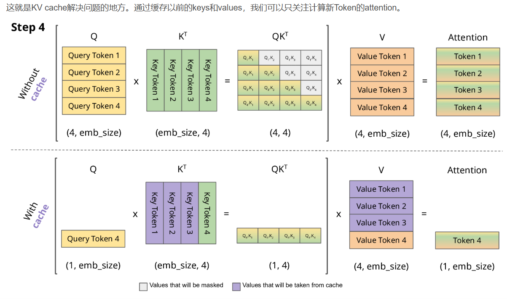

# Paligemma-Learn

**用pytorch从零实现的视觉大模型**

[视频链接](https://www.bilibili.com/video/BV14pH9eVEp6/?spm_id_from=333.1007.top_right_bar_window_default_collection.content.click)

[原作者github仓库](https://github.com/hkproj/pytorch-paligemma)

本文要讨论的几个主题：

1. 视觉transformer
2. 对比学习
3. 语言模型
4. KV-Cache
5. 旋转位置编码
6. 正则化和评估

**先来一张经典图镇楼**：

### 本文总览：

### 对比学习：

clip视觉大模型采用了这种技术，其实就是如下图：

然后希望每一行每一列都接近其他全0，i*i的地方是1。

采用的对比输出和预期分布的损失是cross_entropy_loss，并一般使用 **LogSoftmax**（为了数值稳定性优化，因为softmax要求指数，结果可能很大，超出32位整数范围）

但是softmax这种处理方法存在一个问题，即计算开销大，而且如果想并行，那么一整行的数据必须保存在一个机器上，这给并行计算也带来了困难。因此也有人建议采用sigmod来处理，sigmod的好处是，将每个格子的值看成一个二分类概率，每个格子值的计算不用依赖其他的格子值，因此简单很多。（这也就是siglip）

为什么非要对比学习，而不是直接让视觉transformer直接学习图片的表示？因为视觉多模态模型里，视觉transformer和语言transformer的编码最后是要拼在一起的，我们希望对图片和文本的编码尽可能对齐，而对比学习起到了对齐的效果，同时这种对比学习无监督，而且训练数据好获得。

### 对比：两种正则化

**Batch Normalization**和**Layer Normalization**

- Batch Normalization (BN)：
  - 在Batch维度归一化，依赖Batch内其他样本。
  - 不适合变长序列或小批量训练（如NLP任务）。
  - 同时由于把所有样本的某一维度混合起来了，所以并未完全缓解协变量偏移，需要较大的batch-size
- Layer Normalization (LN)：
  - 在特征维度归一化，独立处理每个样本。
  - 更适合NLP、RNN、Transformer等场景。

语言大模型最后的输出中，每个位置的向量含有前面所有词的信息，而视觉的embeding中每个位置的向量含有所有像素的信息

### 视觉大模型中encoder layer的结构：

其中，重点还是attention，attention的实现也最复杂，但是本质上也就是张量运算

q,k,v可以理解成注意力机制从三种不同的角度看待一个序列

所谓多头注意力，其实就是把一个embeding的表示（如1024维的向量），分成n个部分，然后每个q,k,v都只关注其中一部分进行注意力计算，最后混合起来

### 多头注意力的优势：

1. 可以并行计算缩放点积注意力
2. 多头注意力带来了对某两个词的关联的不同的计算方式（如果只有一个头，那就只能把两个大向量做点积），这可以使得模型学到更好的有关上下文的信息

$$
\text{softmax}(\frac{QK^T}{\sqrt d})V
$$
这个公式的直观理解：softmax后的输出代表了权重，即这个注意力头认为，对V里面的序列（序列里每个值代表一个单词或者一个像素）应该分配多少的权重。

如果是只使用decoder的语言模型，其实内部结构和刚刚上面那个encoder很像了，只是把多头注意力改成了masked multi-head attention。

最后如何将视觉embeding和文本embeding合并到一起？其实就是简单拼起来（paligemma是先创建一个文本的embeding，但是这个embeding前面空了很大的区域用一个\<image>的标记来占位，最后把图片填充到这个占位的地方，但是个人感觉直接两个分别计算然后再拼一起似乎也没问题）

### KV cache

思想：

- 既然每次预测下一个token只使用最后一个token的输出embeding表示，那么为什么还要每次都计算前面的embeding呢？

- 将KV向量保存下来便于后续计算，这样每次生成后，下次输入模型的也只是最后一个token

分两步：预填充和token生成

过程见下图图示：

### RMS norm

在layer_norm之后又提出的新norm方法，思路是：归一化时，保持方差不变很重要，但是保持均值为0似乎没有必要（也已经在实验上验证），因此与其算均值和标准差这两个统计量，不如只算一个统计量：均方根统计量
$$
\text{RMS}(a) = \sqrt (\frac{1}{n}\sum_{i=1}^{n}a_i^2)
$$

### 分组查询注意力

即当query的数量和key-value的数量不一致时

为了解决计算数据传输的问题：多头注意力计算的瓶颈不在于做了多少点积，而在于将内存从高带宽内存（GPU中的内存）复制到本地内存的时间，那么怎么减少数据传输？

方案：不同的查询头共享键-值头，即键头数量小于查询头，比如2:8

优劣：

- 减少了数据传输量
- 减少的KV-cache的内存量
- 当然不可避免的导致模型表现有所下降（但权衡之后可以接受）

### 旋转位置编码

RoPE 具有更好的**外推性**，即在训练时和预测时的输入长度不一致时，更好的避免模型的泛化能力下降。

思想：

- 不直接把位置编码加到token里，而是修改注意力机制，使注意力机制能考虑token的位置信息
- 具体的说，是使得QK^T的点积中能够蕴含相对位置信息。（使点积结果与两个token值，以及相对位置这三个变量决定）

计算公式：[不赘述了，这篇文章讲得很好](https://www.zhihu.com/tardis/bd/art/647109286)

不过想在这里顺便提一句经典的Sinusoidal 位置编码，为什么使用它：

位置编码的数学定义为：
$$
\text{PE}(pos, 2i) = \sin\left(\frac{pos}{10000^{2i/d_{\text{model}}}}\right) 
$$

$$
\text{PE}(pos, 2i+1) = \cos\left(\frac{pos}{10000^{2i/d_{\text{model}}}}\right)
$$

其中：
• **`pos`**：序列中的位置（如第 0、1、2 个 Token）。
• **`i`**：维度索引（从 0 到 `d_model/2-1`）。
• **`d_model`**：模型的隐藏层维度（如 512、768 等）。

为什么要这样定义：

- 具有远程衰减的性质，即如果是两个相同的词向量，那么他们距离越近，内积分数越高
- 采用正弦余弦，可以表示相对位置关系。如位置 `pos + k` 的编码可通过位置 `pos` 的编码线性变换得到
- 一个embeding的不同维度（即pos固定，i变化）可以关注不同的信息：
  - i较小时，sin和cos函数的周期小，频率高，捕捉局部依赖
  - i较大时，sin和cos函数的周期大，频率低，捕捉长程依赖（即要隔好几个pos才回到同一函数值，内积才会相近）

还剩没看的：怎么具体应用kv-cache到attention计算中